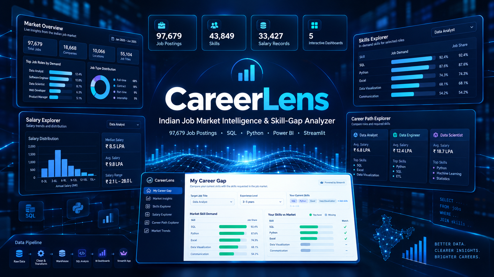

# CareerLens

## Indian Job Market Intelligence & Skill-Gap Analyzer

> Explore the job market. Understand the demand. Discover your next career move.



CareerLens is an end-to-end data analytics project that analyzes **97,679 Indian job postings** to understand job demand, skills, salaries, experience requirements, locations, companies, and work arrangements.

The project combines **Python, Pandas, SQL, DuckDB, Power BI, and Streamlit** to transform raw job-market data into interactive market intelligence and a personalized skill-gap analysis.

---

## 📊 Project at a Glance

| Metric | Value |
|---|---:|
| Job postings analyzed | 97,679 |
| Companies | 18,560 |
| Locations | 4,952 |
| Unique skills | 43,849 |
| Job-skill relationships | 752,930 |
| Job-location relationships | 129,675 |
| Jobs with salary data | 33,427 |

---

## 🎯 What Does CareerLens Do?

CareerLens turns raw job postings into structured market intelligence.

It helps answer questions such as:

- Which jobs are most in demand?
- Which skills are most frequently requested?
- Which skills commonly appear together?
- How do salaries vary across roles?
- How does salary vary with experience?
- Which locations have the most opportunities?
- How do different career paths compare?
- What skills are commonly requested for a target job?
- How does a user's current skill set compare with the market?

---

## 🏗️ Project Pipeline

```text
Raw Job Data
      ↓
Data Ingestion
      ↓
Data Cleaning & Standardization
      ↓
Data Warehouse
      ↓
SQL Analysis
      ↓
Analytical Marts
      ↓
Power BI
      ↓
Streamlit Application
```

# 🗄️ Data Warehouse 

CareerLens uses a relational analytical warehouse built with DuckDB.

```text 
fact_job_posting
       │
       ├── dim_company
       │
       ├── bridge_job_skill ─── dim_skill
       │
       └── bridge_job_location ─── dim_location
```
The warehouse separates job-level facts from reusable dimensions and many-to-many relationships, making the data easier to analyze with SQL and reuse across the Power BI dashboards and Streamlit application.

### Core Tables

fact_job_posting

Contains job-level information including:

Job ID
Company
Job title
Salary
Experience
Work mode
Location

dim_company

Contains standardized company information.

dim_skill

Contains normalized skills extracted from job postings.

dim_location

Contains cleaned job-location information.

bridge_job_skill

Connects jobs with their requested skills.

bridge_job_location

Connects jobs with their locations.

# 🧹 Data Cleaning

The raw dataset required substantial cleaning and standardization before analysis. The cleaning process included:-

Duplicate job detection
Repeated job ID investigation
Salary normalization
Experience normalization
Location cleaning
Skill normalization
Company normalization
Work-mode standardization
Invalid location fragment removal
Duplicate job-skill relationship removal
Missing-value analysis

The final analytical dataset contains:  97,679 unique job postings

# 📈 Analytical Marts

SQL transformations were used to create analytical marts for specific business questions.

Key marts include:
``` text  mart_market_overview
mart_skill_demand
mart_salary_analysis
mart_role_analysis
mart_role_skill_demand
mart_salary_by_title
mart_salary_by_experience
mart_location_demand
```
These marts provide the analytical layer used by the Power BI dashboards and support the Streamlit application.

# 📊 Power BI Dashboards

CareerLens contains five Power BI dashboards.

### 1. Market Overview

Provides a high-level view of the Indian job market.

Includes:

Total job postings
Companies
Locations
Work arrangements
Top job titles
Top companies
Top locations

Primary data sources: mart_market_overview, mart_location_demand

### 2. Skills Explorer

Explores skill demand across the job market and selected roles.

Includes:

Number of unique skills
Top skills by demand
Skill demand by selected role
Job share of individual skills

Primary data sources: mart_skill_demand, mart_role_skill_demand

### 3. Salary Explorer

Explores advertised salary distributions.

Includes:

Jobs with salary information
Median advertised salary
Salary by job title
Salary by experience
Salary by work arrangement

Primary data sources: mart_salary_analysis, mart_salary_by_title, mart_salary_by_experience, dim_work_mode

### 4. Career Path Explorer

Compares selected career paths using job-market evidence.

Current role groups include:

Data Analyst
Data Engineer
Data Scientist

The dashboard compares:

Job volume
Salary information
Experience requirements
Requested skills

Primary data sources: mart_role_analysis, mart_role_skill_demand

### 5. Market Trends

Explores job-posting characteristics using the relative posting-age information available in the dataset.

Includes:

Recent job postings
Posting-age distribution
Experience requirements
Work-mode patterns

Primary data source: mart_market_overview

The source dataset provides relative posting-age information rather than reliable calendar dates. Therefore, CareerLens does not claim to show true monthly or yearly job-market growth.

#💻 My Career Gap

CareerLens includes an interactive Streamlit application that allows users to compare their current skills with skills requested by the job market.

A user selects:
```text 
Target Job
Experience Level
Current Skills
```

CareerLens then analyzes the selected job-market segment and displays:

Skills already possessed by the user
Skills requested by the market
Number of jobs requesting each skill
Job-share percentage
Potential skill gaps
Relevant market evidence

The system intentionally avoids producing an unexplained "employability score."

Instead, the methodology remains transparent so users can understand where the results come from.

# 💰 Salary Analysis

Salary analysis is based on job postings containing usable minimum and maximum salary values.

CareerLens identified:

33,427 jobs with both minimum and maximum annual salary information.

The salary midpoint is calculated as:
```
Salary Midpoint =
(Minimum Salary + Maximum Salary) / 2
```
Salary distributions are analyzed using medians where appropriate rather than relying only on averages.

Important Limitation

Salary relationships represent association, not causation.

For example, a skill appearing more frequently in higher-paying jobs does not prove that learning that skill causes a higher salary.

Salary can also be affected by:

Experience
Role
Company
Location
Industry
Work arrangement

# 👔 Career Role Analysis

CareerLens currently analyzes three major data-career segments:

Role	Job Postings
```
Data Engineer	1,082
Data Scientist	317
Data Analyst	267
```
These role groups are created using job-title matching.

Therefore, they should be interpreted as analytical segments rather than perfect occupational classifications.

# 🌍 Location Analysis

CareerLens separates job-location relationships from the main job table.

This allows a job to be associated with multiple locations without duplicating the core job record.

When measuring job demand by location, CareerLens uses distinct job IDs where appropriate:
```
COUNT(DISTINCT job_id)
```
This prevents multiple location relationships from automatically inflating job counts.


# ⚠️ Data Limitations

CareerLens is designed to clearly communicate the limitations of the underlying data.

Posting Dates

The dataset contains relative posting-age labels such as:
```
Just Now
Few Hours Ago
Today
1 Day Ago
```
It does not provide reliable calendar dates for every posting.

Therefore, the project does not create artificial monthly or yearly job-growth trends.

#### Salary Coverage

A significant portion of job postings does not contain usable salary information.

Salary analysis is therefore limited to postings with valid salary ranges.

#### Role Classification

Some roles are identified using title-based matching.

Job titles can vary between companies, so these categories should be treated as analytical segments rather than perfect job classifications.

#### Skills

Skill information comes from job postings and can contain inconsistent terminology and source-specific values.

CareerLens standardizes the data where practical while preserving the underlying market information.

#### Work Arrangement

Many postings do not explicitly specify whether the position is remote, hybrid, or on-site.

Therefore, work-mode comparisons only reflect postings where this information is available.

# 🛠️ Technology Stack
Data Engineering & Storage
-  DuckDB
-  MotherDuck
-  Parquet

Programming
-  Python
-  Pandas

Analytics
-  SQL
- Statistical analysis
  
Visualization
-  Power BI
- 
Application
-  Streamlit
  
Engineering
-  Git
-  GitHub
-  GitHub Actions
  
Documentation
-  Markdown
